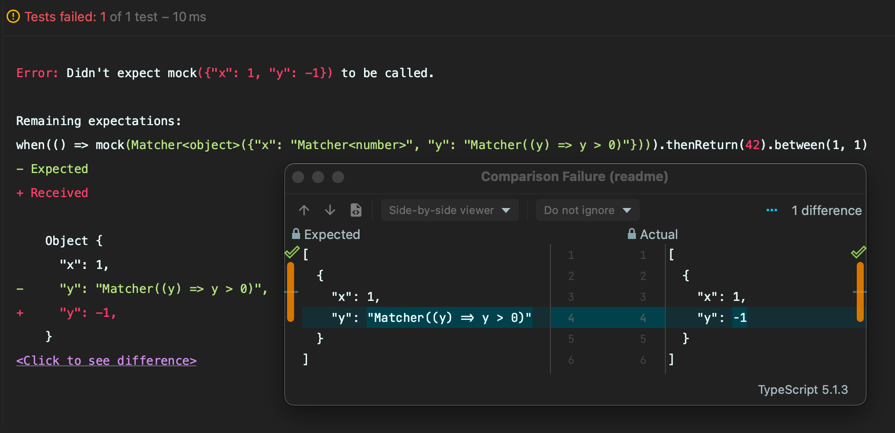
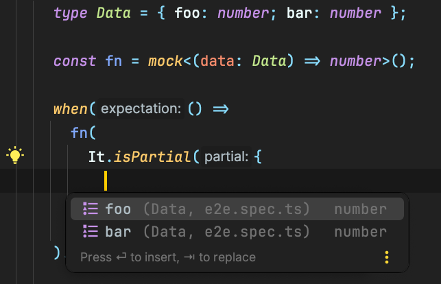
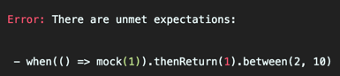

<div align="center">
<h1>💪 strong-mock</h1>

<p>Simple type safe mocking library</p>
</div>

```typescript
import { mock, when, instance } from 'strong-mock';

interface Foo {
  bar: (x: number) => string;
}

const foo = mock<Foo>();

when(foo.bar(23)).thenReturn('I am strong!');

console.log(instance(foo).bar(23)); // 'I am strong!'
```

----

[](https://travis-ci.com/NiGhTTraX/strong-mock) [](https://codecov.io/gh/NiGhTTraX/strong-mock) 

<!-- START doctoc generated TOC please keep comment here to allow auto update -->
<!-- DON'T EDIT THIS SECTION, INSTEAD RE-RUN doctoc TO UPDATE -->
**Table of Contents**

- [Installation](#installation)
- [Requirements](#requirements)
- [Features](#features)
  - [Type safety](#type-safety)
  - [Useful error messages](#useful-error-messages)
  - [Type safe argument matchers](#type-safe-argument-matchers)
- [API](#api)
  - [Setting expectations](#setting-expectations)
  - [Setting multiple expectations](#setting-multiple-expectations)
  - [Setting invocation count expectations](#setting-invocation-count-expectations)
  - [Mocking interfaces](#mocking-interfaces)
  - [Mocking functions](#mocking-functions)
  - [Mocking promises](#mocking-promises)
  - [Throwing errors](#throwing-errors)
  - [Verifying expectations](#verifying-expectations)
  - [Resetting expectations](#resetting-expectations)
  - [Argument matchers](#argument-matchers)
- [FAQ](#faq)
  - [Why do I have to set all expectations first?](#why-do-i-have-to-set-all-expectations-first)
  - [Can I mock an existing object/function?](#can-i-mock-an-existing-objectfunction)
  - [How do I set expectations on setters?](#how-do-i-set-expectations-on-setters)
  - [Why do I have to set a return value even if it's `undefined`?](#why-do-i-have-to-set-a-return-value-even-if-its-undefined)
  - [How do I provide a function for the mock to call?](#how-do-i-provide-a-function-for-the-mock-to-call)

<!-- END doctoc generated TOC please keep comment here to allow auto update -->

## Installation

```
npm i -D strong-mock
```

```
yarn add -D strong-mock
```

## Requirements

strong-mock requires an environment that supports the [ES6 Proxy object](https://developer.mozilla.org/en-US/docs/Web/JavaScript/Reference/Global_Objects/Proxy). This is necessary to create dynamic mocks from types because TypeScript does not support reflection i.e. exposing the type info at runtime.

## Features

### Type safety

The created mock matches the mocked type so all expectations are type safe. Moreover, refactorings in an IDE will also cover your expectations.


### Useful error messages

Error messages include the property that has been accessed, any arguments passed to it and any remaining unmet expectations.



### Type safe argument matchers



## API

### Setting expectations

Expectations are set by calling the mock inside a `when()` call and finishing it by setting a return value.

```typescript
when(foo.bar(23)).thenReturn('awesome');
```

After expectations have been set you need to get an instance of the mock by calling `instance()`.

```typescript
instance(foo)
```

### Setting multiple expectations

You can set as many expectations as you want by calling `when()` multiple times. If you have multiple expectations with the same arguments they will be consumed in the order they were created.

```typescript
when(foo.bar(23)).thenReturn('awesome');
when(foo.bar(23)).thenReturn('even more awesome');

console.log(instance(foo).bar(23)); // awesome
console.log(instance(foo).bar(23)); // even more awesome
```

By default, each call is expected to be called only once. You can expect a call to be made multiple times using the [invocation count](#setting-invocation-count-expectations) helpers.

### Setting invocation count expectations

You can expect a call to be made multiple times by using the invocation count helpers `between`, `atLeast`, `times`, `anyTimes` etc.:

```typescript
const fn = mock<(x: number) => number>();

when(fn(1)).thenReturn(1).between(2, 3);

console.log(instance(fn)(1)); // 1
console.log(instance(fn)(1)); // 1
console.log(instance(fn)(1)); // 1
console.log(instance(fn)(1)); // throws because the expectation is finished
```

### Mocking interfaces

Pass in the interface to the generic argument of `mock`:

```typescript
interface Foo {
  bar: (x: number) => string;
  baz: number;
}

const foo = mock<Foo>();

when(foo.bar(23)).thenReturn('awesome');
when(foo.baz).thenReturn(100);

console.log(instance(foo).bar(23)); // 'awesome'
console.log(instance(foo).baz); // 100
```

Since the mock is type safe the compiler will guarantee that you're only mocking things that actually exist on the interface.

### Mocking functions

You can also mock functions similarly to interfaces:

```typescript
type Fn = (x: number) => number;

const fn = mock<Fn>();

when(fn(1)).thenReturn(2);

console.log(instance(fn)(1)); // 2
```

### Mocking promises

If you're mocking something that returns a promise then you'll be able to use the promise helpers to set the return value.

```typescript
type Fn = (x: number) => Promise<number>;

const fn = mock<Fn>();

when(fn(1)).thenResolve(2);

console.log(await instance(fn)()); // 2
```

### Throwing errors

```typescript
type Fn = (x: number) => void;
type FnWithPromise = (x: number) => Promise<void>;

const fn = mock<Fn>();
const fnWithPromise = mock<FnWithPromise>();

when(fn(1)).thenThrow();
when(fnWithPromise(1)).thenReject();
```

You'll notice there is no `never()` helper - if you expect a call to not be made simply don't set an expectation on it and the mock will throw if the call happens.

### Verifying expectations

Calling `verify(mock)` will make sure that all expectations set on `mock` have been met. If not, the function will throw an error and print the unmet expectations.

```typescript
const fn = mock<(x: number) => number>();

when(fn(1)).thenReturn(1).between(2, 10);

verify(fn); // throws
```



### Resetting expectations

You can remove all expectations from a mock by using the `reset()` method:
                                                                        
```typescript
const fn = mock<(x: number) => number>();

when(fn(1)).thenReturn(1);

reset(fn);

instance(fn)(1); // throws
```

### Argument matchers

Sometimes you're not interested in specifying all the arguments in an expectation. Maybe they've been covered in another test, maybe they're hard to specify e.g. callbacks. In those cases you can use argument matchers to either ignore some arguments or use custom matchers to check them.

```typescript
const fn = mock<(x: number) => string>();

when(fn(It.isAny())).thenReturn('matched!');
when(fn(It.matches(x => x > 0))).thenReturn('greater than zero');

console.log(instance(fn)(123)); // 'matched!'
console.log(instance(fn)(-1)); // throws
console.log(instance(fn)(1)); // 'greater than zero'
```

## FAQ

### Why do I have to set all expectations first?

This library is different from other mocking/spying libraries you might have used before such as [sinon](https://sinonjs.org) or [jest](https://jestjs.io/docs/en/mock-functions). Whereas those libraries are focused on recording calls to the mocks and always returning something, strong-mock requires you to set your expectations upfront. If a call happens that is not expected the mock will throw an error.

This design decision has a few reasons behind it. First of all, it forces you to be aware of what your code needs from its dependencies. Spying libraries encourage checking those needs at the end of the test after the code has already called the mocks. This can lead to tests missing dependency calls that just happen to not throw any error at runtime with the dummy values that the spies return.

Secondly, it will highlight potential design problems such as violations of the SOLID principles. If you find yourself duplicating expectations between tests and passing dummy values to them because your test is not concerned with them then you might want to look into splitting the code to only depend on things it really needs.

### Can I mock an existing object/function?

No, although you can pass its type to `mock()` and set expectations on it as you would with a type.

### How do I set expectations on setters?

You currently can't do that. Please use a normal method instead e.g. `setFoo()` vs `set foo()`.

### Why do I have to set a return value even if it's `undefined`?

To make side effects explicit and to prevent future refactoring headaches. If you would have just `when(fn())` and you later changed `fn()` to return a `number` then your expectation would become incorrect and the compiler couldn't check that for you.

### How do I provide a function for the mock to call?

There is no `thenCall()` method because it can't be safely typed - the type for `thenReturn()` is inferred from the return type in `when()`, meaning that the required type would be the return value for the function, not the function itself. However, we can leverage this by setting an expectation on the function property instead:

```typescript
interface Foo {
  bar: (x: number) => string;
}

const foo = mock<Foo>();

when(foo.bar).thenReturn(x => `called ${x}`);

console.log(instance(foo).bar(23)); // 'called 23'
```

The function in `thenReturn()` will be type checked against the actual interface so you can make sure you're passing in an implementation that makes sense. Moreover, refactoring the interface will also refactor the expectation (in a capable IDE).


