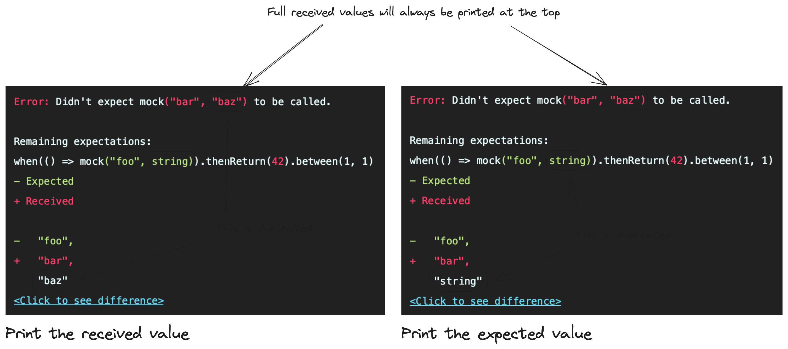

# Matcher diffs

## Context

```typescript
when(() => fn('foo', It.isString())).thenReturn(42);

fn('bar', 'baz');
```

The above will throw an `UnexpectedCall` error:

```
Didn't expect mock('bar', 'baz') to be called.
```

The error will format all the received arguments, and print all the remaining expectations for that property/call: 

```
Remaining expectations:

mock(() => fn('foo', 'string')).thenReturn(42)
```

Every expectation in the above list will format all the expected arguments, which are always matchers. The matcher's `toString` method will be called to get the pretty printed output.

This will be followed by a detailed diff between the received arguments and the expected matchers.

```
- Expected
+ Received

-    "foo",
+    "bar",
     <to be decided>
```

This ADR aims to cover printing arguments that match the expected values as part of a larger diff. Mismatching arguments will always be printed using the matcher's `getDiff` implementation.

## Decision drivers

- recommendation vs requirement: the decision should either be easy to follow, or easy to enforce, so that all matchers, both built-in and user-made, can produce consistent diffs
- printing the expectation vs printing the diff: the expectation will always use `toString` to give a pretty representation of the expected arguments, so in the example above it will show `string` for the `isString` matcher; the diff that follows should take this into consideration from the point of view of repeating information or presenting different information
- state of the art: people coming from other libraries should not abandon their habits of understanding an error message

## Considered options



### Print the received value

```
- Expected
+ Received

-  'foo',
+  'bar',
   'baz' // <-
```

#### Pros

- can be easily implemented in matcher handling logic, removing the need for individual matchers to handle this case
- diffs will contain all the received values, potentially making debugging easier
- the diff will be consistent with the printed expectation

#### Cons

- the received value is repeated from the top of the error message
- the diff becomes larger
- if the matcher's differ will only be called for mismatches, the implementation might run into issues due to exhaustiveness checks; the implementation might end up suppressing a type error, or returning a value that will never be used

### Print the expected value

```
- Expected
+ Received

-  'foo',
+  'bar',
   string // <-
```

#### Pros

- makes the diff leaner by removing irrelevant details

#### Cons

- matchers must handle the case where the received value matches the expected value and return a representation of the received value according to the matcher's definition
- except for `deepEquals` and `is`, all matchers will hide some part of the received value in the diff, potentially making debugging harder; the full values will always be present at the top of the error message, but with large diffs that might be easy to miss
- increases matcher complexity, as values can be formatted naively e.g. `object` for `isObject`, or in a more complex way e.g. showing only the partial match for `isObject(partial)`
- increases duplication between `toString` and `getDiff`

### State of the art

- jest: prints received value

```typescript
const fn = jest.fn();
fn('bar', 'baz');
expect(fn).toHaveBeenCalledWith('foo', expect.any(String));
```

```
Expected: "foo", Any<String>
Received: "bar", "baz"
```

- sinon: prints expected value

```typescript
const cb = sinon.spy();

cb("bar", "baz");

sinon.assert.calledWith(cb, "foo", sinon.match(''));
```

```
Error: expected spy to be called with arguments 
'"bar"' '"foo"' 
'"baz"' match("")
```

## Decision outcome

Due to the increased implementation cost and unclear benefits of printing the expected values, the decision is to always print the received values.

## Consequences

In the future, if the alternative proves more desirable, switching to it will be a breaking change, unless it's added as an option.
